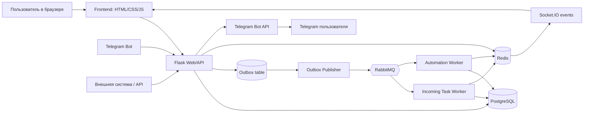
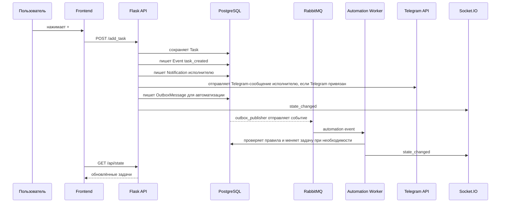
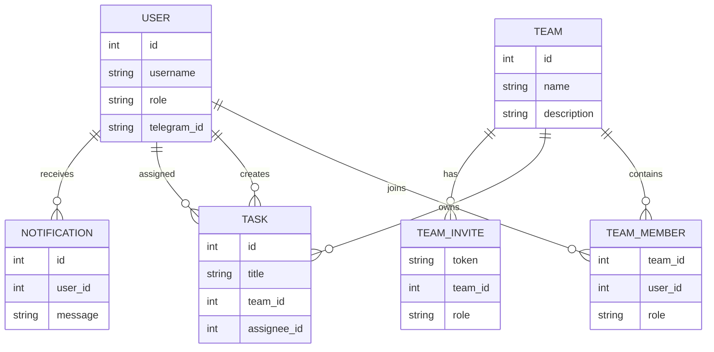
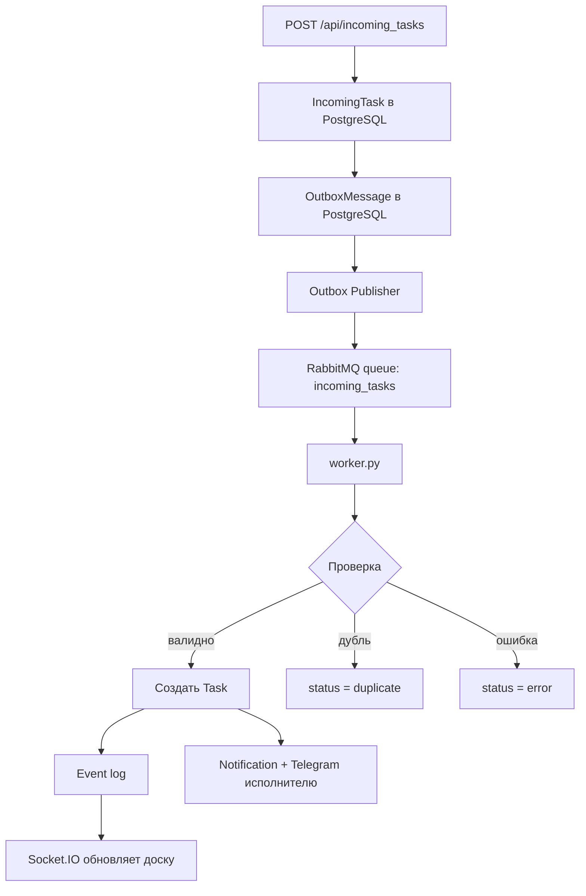
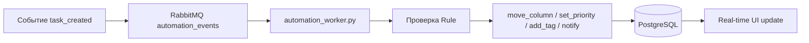

<p align="center">
  
</p>

<h1 align="center">NineCell — Kanban Event System</h1>

<p align="center">
  Real-time канбан-система с командами, автоматизацией событий, RabbitMQ-очередью, Telegram-ботом, персональными уведомлениями и Docker-развёртыванием.
</p>

<p align="center">
  <b>Flask</b> · <b>PostgreSQL</b> · <b>RabbitMQ</b> · <b>Redis</b> · <b>Socket.IO</b> · <b>Docker Compose</b> · <b>Telegram Bot</b>
</p>

---

## Содержание

- [О проекте](#о-проекте)
- [Что реализовано по ТЗ](#что-реализовано-по-тз)
- [Архитектура](#архитектура)
- [Как работает система](#как-работает-система)
- [Как работают пользователи и видимость задач](#как-работают-пользователи-и-видимость-задач)
- [Как работают команды](#как-работают-команды)
- [Как работают уведомления](#как-работают-уведомления)
- [Как работает Telegram-бот](#как-работает-telegram-бот)
- [Как работает очередь задач RabbitMQ](#как-работает-очередь-задач-rabbitmq)
- [Как работает автоматизация](#как-работает-автоматизация)
- [Запуск локально через Docker](#запуск-локально-через-docker)
- [Демо-аккаунты](#демо-аккаунты)
- [Проверка системы](#проверка-системы)
- [Работа с базой данных](#работа-с-базой-данных)
- [Развёртывание на сервере](#развёртывание-на-сервере)
- [Структура проекта](#структура-проекта)
- [Troubleshooting](#troubleshooting)
- [Что можно улучшить дальше](#что-можно-улучшить-дальше)

---

## О проекте

**NineCell** — это мини-Jira/Trello для командной работы над задачами.

Система умеет:

- показывать задачи на канбан-доске;
- синхронизировать изменения между пользователями в реальном времени;
- принимать задачи извне через API и Telegram-бота;
- обрабатывать входящие задачи через RabbitMQ;
- проверять дубли, валидировать и обогащать входящие задачи;
- применять правила автоматизации;
- управлять командами, участниками и invite-ссылками;
- отправлять уведомления в интерфейсе и в Telegram назначенному исполнителю;
- очищать личную ленту уведомлений;
- показывать историю событий.

Проект сделан как хакатонная система с **event-driven архитектурой**.

---

## Что реализовано по ТЗ

| Требование | Статус |
|---|---|
| Канбан-доска To Do / In Progress / Done | ✅ |
| Кастомные колонки | ✅ |
| Создание, редактирование, удаление, перемещение задач | ✅ |
| Drag-and-drop задач | ✅ |
| Карточка задачи: ID, название, описание, статус, приоритет, теги, дата создания, дедлайн | ✅ |
| Пользователи и авторизация | ✅ |
| Telegram-вход через одноразовый код | ✅ |
| Команды и роли | ✅ |
| Invite-ссылки для вступления в команду | ✅ |
| Real-time обновления | ✅ |
| Персональные уведомления | ✅ |
| Очистка уведомлений | ✅ |
| Telegram-уведомления назначенному исполнителю | ✅ |
| События: создание, обновление, перемещение, удаление | ✅ |
| Event log / история событий | ✅ |
| Правила автоматизации | ✅ |
| Очередь задач через RabbitMQ | ✅ |
| Валидация входящих задач | ✅ |
| Дедубликация | ✅ |
| Обогащение входящих задач | ✅ |
| Telegram-бот для входа и создания задач | ✅ |
| Docker Compose запуск | ✅ |
| PostgreSQL вместо SQLite | ✅ |
| Redis для Socket.IO | ✅ |
| README с архитектурой и запуском | ✅ |

---

## Архитектура



### Что за что отвечает

| Компонент | Роль |
|---|---|
| `web` | Flask-приложение: страницы, API, авторизация, команды, задачи |
| `postgres` | основная база данных |
| `rabbitmq` | очередь сообщений и событий |
| `redis` | брокер для Socket.IO между web и worker-процессами |
| `worker` | обрабатывает входящие задачи из очереди |
| `outbox` | публикует сообщения из таблицы `outbox_message` в RabbitMQ |
| `automation` | применяет правила автоматизации по событиям |
| `telegram_bot` | Telegram-интерфейс: вход, создание задач, кнопки бота |

---

## Как работает система

### Создание обычной задачи через сайт



### Почему задачи сохраняются

Задачи хранятся не в браузере, а в PostgreSQL.

Если ты создала задачу, закрыла браузер и открыла снова — backend снова читает её из базы.

Если проект запущен локально, база живёт в Docker volume на твоём компьютере.  
Если проект развёрнут на сервере, база живёт на сервере.

---

## Как работают пользователи и видимость задач

У каждой задачи есть поля:

| Поле | Значение |
|---|---|
| `creator_id` | кто создал задачу |
| `assignee_id` | кому задача назначена |
| `team_id` | к какой команде относится задача |

### Личная задача

Если задача создана **без команды**, её видят:

- создатель;
- назначенный исполнитель;
- глобальный `admin`.

### Командная задача

Если задача создана **в команде**, её видят:

- все участники этой команды;
- назначенный исполнитель;
- глобальный `admin`.

---

## Как работают команды

В системе есть:

- пользователи;
- команды;
- участники команд;
- роли внутри команды;
- invite-ссылки.



### Как пригласить человека в команду

1. Войти как `admin` или админ команды.
2. Открыть раздел **Команды**.
3. Развернуть нужную команду.
4. Нажать **Создать invite-ссылку**.
5. Скопировать ссылку.
6. Отправить человеку в Telegram/чат.

Если сервис запущен локально, ссылка будет вида:

```text
http://localhost:5000/join/...
```

Такая ссылка работает только на твоём компьютере.

Чтобы другой человек смог вступить по ссылке, проект должен быть развёрнут на сервере:

```text
http://SERVER_IP:5000/join/...
```

или на домене:

```text
https://ninecell.example.com/join/...
```

---

## Как работают уведомления

В NineCell есть два типа уведомлений:

1. **toast-уведомления** в интерфейсе;
2. **персональная лента уведомлений** в разделе `Уведомления`;
3. **Telegram-уведомления назначенному исполнителю**, если пользователь связал аккаунт с Telegram.

### Персональные уведомления

Когда пользователю назначают задачу, создаётся запись в таблице:

```text
notification
```

Пример:

```text
Вам назначена задача #15: "Исправить баг оплаты"
```

Эта запись отображается в разделе **Уведомления** у конкретного пользователя.

### Очистка уведомлений

В разделе **Уведомления** есть кнопка:

```text
Очистить
```

Она вызывает endpoint:

```text
POST /api/notifications/clear
```

Очистка удаляет уведомления только у текущего пользователя.  
Уведомления других пользователей не трогаются.

### Telegram-уведомления назначенному

Если задача назначается пользователю, у которого есть связанный Telegram-аккаунт, система отправляет сообщение в Telegram.

Пример сообщения:

```text
Вам назначена задача #15: "Исправить баг оплаты"
```

Если задан `PUBLIC_BASE_URL`, в сообщение можно добавить ссылку на сайт.

Пример `.env`:

```env
PUBLIC_BASE_URL=http://localhost:5000
```

Для сервера:

```env
PUBLIC_BASE_URL=http://SERVER_IP:5000
```

### Когда Telegram-уведомление отправляется

Telegram-уведомление приходит, если:

- задачу создали и сразу назначили исполнителю;
- задачу отредактировали и сменили исполнителя;
- задача пришла через очередь/API и у неё указан исполнитель;
- пользователь-исполнитель уже входил через Telegram-код или был связан с Telegram.

### Когда Telegram-уведомление НЕ придёт

Telegram-уведомление не придёт, если:

- у пользователя нет `telegram_id`;
- пользователь ни разу не входил через Telegram-код;
- в `.env` не указан `TELEGRAM_BOT_TOKEN`;
- контейнеры не были перезапущены после изменения `.env`;
- бот заблокирован пользователем в Telegram.

---

## Как работает Telegram-бот

Бот умеет:

- выдавать одноразовый код для входа;
- создавать задачи из Telegram;
- отправлять задачи во входящий поток.

### Кнопки бота

После `/start` бот показывает кнопки:

- `🔐 Получить код`
- `📝 Создать задачу`

### Вход через Telegram

1. Открыть бота.
2. Нажать `🔐 Получить код`.
3. Получить 6-значный код.
4. Ввести код на странице входа.
5. Система создаст или найдёт пользователя по `telegram_id`.

### Создание задачи через Telegram

Можно нажать кнопку:

```text
📝 Создать задачу
```

и следующим сообщением отправить:

```text
Срочно: баг оплаты #bug #urgent #payment
```

Или использовать команду:

```text
/task Срочно: баг оплаты #bug #urgent #payment
```

После этого задача пойдёт по цепочке:

```text
Telegram → Flask API → PostgreSQL Outbox → RabbitMQ → worker → Канбан-доска
```

---

## Как работает очередь задач RabbitMQ

Очередь нужна для задач, которые приходят не руками через сайт, а извне:

- Telegram-бот;
- CRM;
- GitHub;
- форма поддержки;
- другой сервис через API.



### Что делает worker

Worker берёт сообщение из RabbitMQ и выполняет:

| Этап | Что значит |
|---|---|
| Валидация | проверяет, есть ли название, нормальный ли приоритет, дата и т.д. |
| Дедубликация | проверяет, не приходила ли такая задача раньше |
| Обогащение | автоматически улучшает задачу: например, `urgent` → `critical`, `bug` → `high` |
| Создание задачи | создаёт обычную карточку на доске |
| Уведомление исполнителю | создаёт уведомление и отправляет Telegram, если исполнитель привязан |
| Event log | пишет событие в историю |
| Real-time update | обновляет доску у пользователей |

---

## Как работает автоматизация

Автоматизация работает по схеме:

```text
событие → условие → действие
```

Примеры:

| Событие | Условие | Действие |
|---|---|---|
| задача создана | priority = critical | переместить в In Progress |
| входящая задача | tags содержит bug | поставить priority = high |
| задача перемещена | column = Done | отправить уведомление |



---

## Запуск локально через Docker

### 1. Установить Docker Desktop

Для Windows/macOS нужен Docker Desktop.

После установки открой Docker Desktop и дождись, пока Docker Engine запустится.

Проверка:

```powershell
docker --version
docker compose version
docker info
```

### 2. Создать `.env`

Скопировать пример:

```powershell
copy .env.example .env
```

Минимальный `.env`:

```env
SECRET_KEY=change-me-super-secret
INCOMING_API_KEY=dev-incoming-token
TELEGRAM_BOT_TOKEN=
TELEGRAM_BOT_USERNAME=
TELEGRAM_LOGIN_TTL_SECONDS=600
PUBLIC_BASE_URL=http://localhost:5000
```

Если Telegram-бот пока не нужен, поля `TELEGRAM_BOT_TOKEN` и `TELEGRAM_BOT_USERNAME` можно оставить пустыми.

### 3. Запустить

```powershell
cd C:\Users\marin\PycharmProjects\AI_slop
docker compose up --build
```

Открыть приложение:

```text
http://localhost:5000
```

RabbitMQ Management:

```text
http://localhost:15672
```

Логин/пароль RabbitMQ:

```text
kanban / kanban
```

---

## Демо-аккаунты

| Роль | Логин | Пароль |
|---|---|---|
| Админ | `admin` | `admin123` |
| Пользователь | `user` | `user123` |

---

## Проверка системы

### 1. Проверить обычный вход

1. Открыть `http://localhost:5000`.
2. Войти как `admin / admin123`.
3. Убедиться, что открылась канбан-доска.

### 2. Проверить создание задачи

1. Нажать большую кнопку `+`.
2. Создать задачу.
3. Обновить страницу.
4. Задача должна остаться.

### 3. Проверить real-time

1. Открыть обычное окно браузера.
2. Войти как `admin`.
3. Открыть инкогнито.
4. Войти как `user`.
5. Создать командную задачу.
6. У второго пользователя она должна появиться без ручного обновления.

### 4. Проверить команды

1. Войти как `admin`.
2. Создать команду.
3. Добавить `user` в команду.
4. Создать задачу в этой команде.
5. Войти как `user`.
6. Проверить, что задача видна.

### 5. Проверить личные задачи

1. Войти как `admin`.
2. Создать задачу без команды.
3. Войти как `user`.
4. Задача не должна быть видна обычному пользователю.

### 6. Проверить invite-ссылку

1. Войти как `admin`.
2. Открыть **Команды**.
3. Создать invite-ссылку.
4. Открыть ссылку в инкогнито.
5. Войти или зарегистрироваться.
6. Пользователь должен попасть в команду.

### 7. Проверить очистку уведомлений

1. Войти любым пользователем.
2. Назначить этому пользователю задачу.
3. Открыть раздел **Уведомления**.
4. Убедиться, что уведомление появилось.
5. Нажать **Очистить**.
6. Уведомления должны исчезнуть только у текущего пользователя.

### 8. Проверить Telegram-уведомление назначенному

1. Открыть Telegram-бота.
2. Нажать `🔐 Получить код`.
3. Войти на сайт через этот код.
4. Войти вторым аккаунтом как `admin`.
5. Создать задачу и назначить её на Telegram-пользователя.
6. В Telegram этому пользователю должно прийти сообщение о назначении.

Если сообщение не пришло, проверить:

```env
TELEGRAM_BOT_TOKEN=...
TELEGRAM_BOT_USERNAME=...
PUBLIC_BASE_URL=http://localhost:5000
```

Потом перезапустить:

```powershell
docker compose down
docker compose up --build
```

### 9. Проверить очередь RabbitMQ

Во втором PowerShell:

```powershell
$body = @{
  source = "api"
  external_id = "demo-queue-001"
  title = "Срочно: баг оплаты"
  description = "Проверка RabbitMQ"
  tags = "bug, urgent, payment"
  team = "Victory Group"
  assignee = "user"
} | ConvertTo-Json

Invoke-RestMethod `
  -Uri "http://localhost:5000/api/incoming_tasks" `
  -Method POST `
  -Headers @{"X-API-Key"="dev-incoming-token"} `
  -ContentType "application/json" `
  -Body $body
```

Ожидаемый результат:

- API вернёт `queued`;
- в RabbitMQ появится сообщение;
- worker обработает задачу;
- карточка появится на доске;
- если у исполнителя привязан Telegram — он получит сообщение.

### 10. Проверить дедубликацию

Отправить тот же запрос ещё раз с тем же:

```text
external_id = demo-queue-001
```

Новая карточка не должна создаться повторно.

### 11. Проверить Telegram-бота

В Telegram:

```text
/start
```

Нажать:

```text
🔐 Получить код
```

Проверить вход через код.

Потом:

```text
📝 Создать задачу
```

Отправить:

```text
Срочно: сломалась оплата #bug #urgent
```

Задача должна появиться на доске.

---

## Работа с базой данных

Зайти в PostgreSQL:

```powershell
docker compose exec postgres psql -U kanban -d kanban
```

Посмотреть таблицы:

```sql
\dt
```

Полезные запросы:

```sql
SELECT id, username, role, telegram_id, telegram_username
FROM "user";

SELECT id, name, description FROM team ORDER BY id;

SELECT team_id, user_id, role FROM team_member ORDER BY team_id;

SELECT id, title, priority, tags, team_id, assignee_id, version
FROM task
ORDER BY id DESC;

SELECT id, user_id, task_id, message, type, is_read, created_at
FROM notification
ORDER BY id DESC;

SELECT id, source, external_id, status, task_id, error
FROM incoming_task
ORDER BY id DESC;

SELECT id, routing_key, status, attempts, error
FROM outbox_message
ORDER BY id DESC;

SELECT id, type, task_id, created_at
FROM event
ORDER BY id DESC
LIMIT 20;
```

Выйти:

```sql
\q
```

### Очистить уведомления вручную через БД

Осторожно: это удалит уведомления.

```sql
DELETE FROM notification WHERE user_id = 1;
```

Удалить все уведомления:

```sql
DELETE FROM notification;
```

### Полностью очистить базу

Осторожно: это удалит все данные PostgreSQL volume.

```powershell
docker compose down -v
docker compose up --build
```

---

## Развёртывание на сервере

Минимальный вариант для VPS:

```bash
git clone https://github.com/your-user/your-repo.git
cd your-repo
cp .env.example .env
nano .env
docker compose up -d --build
```

После запуска:

```text
http://SERVER_IP:5000
```

### Что поменять перед публичным запуском

В `.env`:

```env
SECRET_KEY=сложный_секретный_ключ
INCOMING_API_KEY=сложный_api_ключ
TELEGRAM_BOT_TOKEN=токен_бота
TELEGRAM_BOT_USERNAME=имя_бота_без_@
PUBLIC_BASE_URL=http://SERVER_IP:5000
```

Для production желательно добавить:

- nginx;
- HTTPS;
- закрыть наружу порты PostgreSQL, RabbitMQ, Redis;
- backup PostgreSQL;
- нормальный домен;
- `debug=False`.

---

## Структура проекта

```text
AI_slop/
├── app.py                    # основной Flask backend
├── worker.py                 # обработка входящих задач из RabbitMQ
├── automation_worker.py      # автоматизация правил через RabbitMQ
├── outbox_publisher.py       # отправка outbox-сообщений в RabbitMQ
├── rabbitmq_client.py        # настройка exchange/queue
├── telegram_bot.py           # Telegram-бот
├── docker-compose.yml        # web + postgres + rabbitmq + redis + workers
├── dockerfile                # образ Python-приложения
├── requirements.txt          # зависимости Python
├── README.md
├── TESTING.md
├── static/
│   ├── css/
│   │   ├── styles.css
│   │   └── branding.css
│   └── img/
│       ├── ninecell-logo.svg
│       └── ninecell-mark.svg
└── templates/
    ├── index.html
    ├── login.html
    ├── register.html
    └── join_result.html
```

---

## Troubleshooting

### Docker пишет `failed to connect to docker API`

Docker Desktop не запущен.

Решение:

1. Открыть Docker Desktop.
2. Дождаться запуска Engine.
3. Повторить:

```powershell
docker compose up --build
```

### Docker пишет `WSL needs updating`

Открыть PowerShell от имени администратора:

```powershell
wsl --update
wsl --shutdown
```

Потом перезапустить Docker Desktop.

### Ошибка `View function mapping is overwriting an existing endpoint function`

В `app.py` два раза объявлен один и тот же route, например:

```python
@app.route("/delete_team/<int:team_id>")
def delete_team(...)
```

Нужно оставить только один такой блок.

### Ошибка `NoneType object has no attribute is_authenticated`

Это значит, что worker вызывает код, который использует `current_user`.  
В фоновых worker-процессах нет браузерной сессии.

Решение:

- `emit_state()` не должен использовать `current_user`;
- фоновые функции должны работать через данные из базы, а не через сессию браузера.

### Telegram-уведомления не приходят

Проверить:

1. Пользователь входил через Telegram-код.
2. В базе у пользователя есть `telegram_id`.
3. В `.env` указан `TELEGRAM_BOT_TOKEN`.
4. Контейнеры перезапущены после изменения `.env`.
5. Пользователь не заблокировал бота.
6. Бот работает и отвечает на `/start`.

Проверить пользователя в БД:

```sql
SELECT id, username, telegram_id, telegram_username
FROM "user";
```

### Логотип не отображается, 404 `/static/img/ninecell-mark.svg`

Проверь, что файл лежит здесь:

```text
static/img/ninecell-mark.svg
```

И перезапусти:

```powershell
docker compose down
docker compose up --build
```

---

## Что можно улучшить дальше

- Добавить workspace/organization над командами.
- Добавить полноценные проекты/boards внутри команд.
- Добавить Google OAuth.
- Добавить личные настройки уведомлений.
- Добавить комментарии к задачам.
- Добавить вложения к задачам.
- Добавить полноценный audit trail по каждому изменению.
- Добавить e2e-тесты.
- Добавить nginx и HTTPS для production.
- Добавить backup PostgreSQL.
- Добавить CI/CD через GitHub Actions.

---

## Коротко для защиты

> NineCell — это канбан-система с event-driven архитектурой. Пользователи работают в командах, создают и перемещают задачи, а изменения синхронизируются в реальном времени через Socket.IO. Входящий поток задач реализован через API, PostgreSQL Outbox, RabbitMQ и worker-процессы. Каждая задача проходит валидацию, дедубликацию и обогащение. Автоматизация реагирует на события и выполняет правила: перемещение, изменение приоритета, добавление тегов и уведомления. Также реализованы Telegram-бот, Telegram-вход, персональные уведомления, очистка уведомлений и Telegram-сообщения назначенному исполнителю. Проект запускается через Docker Compose и готов к развёртыванию на сервере.

---

## Prime v3: что улучшено в этой версии

Эта версия усилена под хакатонную защиту и демонстрацию инженерной зрелости проекта.

### Новые возможности

- **System Health Dashboard** — админская панель статуса PostgreSQL, RabbitMQ, Redis, очередей, outbox и ошибок входящего потока.
- **Retry для входящих задач** — ошибочные записи в очереди можно отправить на повторную обработку через RabbitMQ.
- **Prime Demo Mode** — одна кнопка создаёт демонстрационную команду, задачи, правило автоматизации и входящую задачу в RabbitMQ.
- **Activity Feed задачи** — у карточки задачи появилась кнопка истории, которая показывает события именно по этой задаче.
- **Улучшенные фильтры** — можно быстро показать только свои задачи, просроченные, задачи без исполнителя или задачи с дедлайном сегодня.
- **Усиленные Telegram-уведомления** — назначенный исполнитель получает сообщение в Telegram, если его аккаунт связан с ботом.
- **Более удобная панель входящего потока** — статусы отображаются цветными бейджами, ошибки видны сразу.

### Как показать на защите

1. Запустить проект через Docker Compose.
2. Войти как `admin / admin123`.
3. Нажать **🚀 Demo Mode**.
4. Открыть **Статус** и показать, что видны PostgreSQL, Redis, RabbitMQ и очереди.
5. Открыть **Очередь** и показать входящую задачу.
6. Открыть RabbitMQ Management UI: `http://localhost:15672`.
7. Открыть задачу на доске и нажать кнопку **🧾** — показать activity feed.
8. Открыть второй браузер как `user / user123` и показать real-time обновления.

### Новые API endpoints

```text
GET  /api/health
POST /api/demo/prime
POST /api/incoming_tasks/<incoming_id>/retry
GET  /api/tasks/<task_id>/activity
```

### Почему это важно по ТЗ

- `GET /api/health` усиливает критерий **надёжность** и помогает показать состояние системы.
- `Retry` усиливает критерий **сообщения не теряются, ошибки обрабатываются**.
- `Activity Feed` усиливает критерий **event-driven architecture**.
- `Demo Mode` помогает быстро показать жюри все ключевые функции без ручной подготовки.
