<p align="center">
  
</p>

<h1 align="center">NineCell</h1>

<p align="center">
  NineCell - это канбан-система для командной работы с real-time синхронизацией, ролями, автоматизацией, очередью входящих задач, Telegram-ботом и мониторингом состояния системы.
</p>

<p align="center">
  <b>Flask</b> · <b>PostgreSQL</b> · <b>RabbitMQ</b> · <b>Redis</b> · <b>Socket.IO</b> · <b>Docker Compose</b> · <b>Telegram Bot</b>
</p>

---

## Оглавление

- [О проекте](#о-проекте)
- [Для кого сделан NineCell](#для-кого-сделан-ninecell)
- [Сильные стороны проекта](#сильные-стороны-проекта)
- [Основные функции](#основные-функции)
- [Скриншоты интерфейса](#скриншоты-интерфейса)
- [Как пользоваться сервисом](#как-пользоваться-сервисом)
- [Роли и права доступа](#роли-и-права-доступа)
- [Команды и приглашения](#команды-и-приглашения)
- [Задачи и канбан-доска](#задачи-и-канбан-доска)
- [Фильтры и поиск](#фильтры-и-поиск)
- [Уведомления](#уведомления)
- [Telegram-бот](#telegram-бот)
- [Входящий поток задач](#входящий-поток-задач)
- [Правила автоматизации](#правила-автоматизации)
- [История событий](#история-событий)
- [System Health Dashboard](#system-health-dashboard)
- [Архитектура для программистов](#архитектура-для-программистов)
- [Как работает сохранение и синхронизация](#как-работает-сохранение-и-синхронизация)
- [Как работает очередь RabbitMQ](#как-работает-очередь-rabbitmq)
- [Как работает безопасность и приватность данных](#как-работает-безопасность-и-приватность-данных)
- [Запуск через Docker](#запуск-через-docker)
- [Запуск без Docker](#запуск-без-docker)
- [Демо-аккаунты](#демо-аккаунты)
- [Работа с базой данных](#работа-с-базой-данных)
- [Развёртывание на сервере](#развёртывание-на-сервере)
- [Планы на будущее](#планы-на-будущее)
- [Частые проблемы](#частые-проблемы)
- [Структура проекта](#структура-проекта)

---

## О проекте

**NineCell** - это сервис для управления задачами и командной работы.

Он помогает организовать рабочий процесс так, чтобы команда видела:

- какие задачи нужно сделать;
- кто за них отвечает;
- какой у задачи приоритет;
- когда дедлайн;
- в какой колонке находится задача;
- какие события уже произошли;
- какие задачи пришли из внешних источников;
- какие правила автоматизации сработали.

NineCell объединяет в одном продукте обычную канбан-доску, роли пользователей, команды, уведомления, Telegram-интеграцию, входящую очередь задач и автоматическую обработку событий.

---

## Для кого сделан NineCell

### Для пользователей

NineCell помогает быстро работать с задачами:

- создавать задачи;
- назначать исполнителей;
- следить за дедлайнами;
- видеть задачи своей команды;
- получать уведомления;
- использовать Telegram для входа и быстрого создания задач.

### Для администраторов и менеджеров

NineCell даёт инструменты управления процессом:

- создание команд;
- управление участниками;
- назначение ролей;
- настройка колонок;
- настройка правил автоматизации;
- контроль входящего потока задач;
- просмотр статуса системы;
- работа с ошибками очереди.

### Для программистов

NineCell демонстрирует полноценную backend-архитектуру:

- Flask API;
- PostgreSQL как основная база;
- RabbitMQ для очередей;
- Redis для real-time событий;
- Socket.IO для обновлений интерфейса;
- worker-процессы;
- transactional outbox;
- дедубликация сообщений;
- идемпотентность;
- оптимистичная блокировка задач;
- Docker Compose для запуска всех сервисов.

---

## Сильные стороны проекта

### 1. Это не просто CRUD, а событийная система

NineCell не только сохраняет задачи в базу. Каждое важное действие превращается в событие:

- задача создана;
- задача обновлена;
- задача перемещена;
- задача удалена;
- задача назначена исполнителю;
- пришла входящая задача;
- сработало правило автоматизации.

События помогают отслеживать, что происходило в системе, и запускать автоматические реакции.

---

### 2. Real-time обновления

Когда один пользователь меняет задачу, другие пользователи получают обновление без ручной перезагрузки страницы.

Это важно для командной работы: участники видят актуальную доску и не работают со старыми данными.

---

### 3. Разделение прав доступа

В NineCell разные пользователи видят разные данные.

Обычный пользователь не видит административные разделы и чужие задачи, если у него нет прав доступа.

Администратор видит больше:

- все команды;
- настройки автоматизации;
- входящий поток задач;
- статус системы;
- больше технических данных;
- управление пользователями и командами.

Такой подход делает систему безопаснее и ближе к реальным корпоративным продуктам.

---

### 4. Команды и роли

В системе есть командная модель:

- команда;
- участники команды;
- роль участника;
- invite-ссылки;
- командные задачи.

Это позволяет работать не только одному пользователю, а целой группе.

---

### 5. Входящий поток задач

NineCell умеет принимать задачи извне.

Например, задача может прийти:

- из Telegram-бота;
- из API;
- из CRM;
- из формы поддержки;
- из GitHub Issues в будущем;
- из другого сервиса.

Такие задачи не создаются напрямую. Они проходят через очередь, обработку, проверку и только потом попадают на доску.

---

### 6. RabbitMQ и worker-процессы

RabbitMQ используется для обработки входящих задач и событий автоматизации.

Это позволяет разделить:

- веб-приложение;
- обработку входящих сообщений;
- автоматизацию;
- публикацию outbox-сообщений.

Такой подход делает систему более масштабируемой.

---

### 7. Outbox Pattern

Проект использует **Transactional Outbox**.

Суть простая:

1. API сохраняет входящую задачу в базу.
2. API сохраняет сообщение в таблицу `outbox_message`.
3. Отдельный процесс отправляет сообщение в RabbitMQ.
4. Если RabbitMQ временно недоступен, сообщение не теряется.

Это важная инженерная часть проекта, которая повышает надёжность.

---

### 8. Дедубликация и идемпотентность

Если внешняя система случайно отправит одну и ту же задачу дважды, NineCell старается не создавать дубль.

Для этого используются:

- `external_id`;
- проверка по названию и тегам;
- таблица обработанных сообщений.

Это важно для очередей: в реальных системах сообщение иногда может прийти повторно.

---

### 9. Автоматическое обогащение задач

NineCell может автоматически улучшать входящую задачу.

Например:

- если в тексте есть `urgent` или `срочно`, приоритет становится `critical`;
- если есть `bug`, `баг` или `ошибка`, приоритет становится `high`.

Это помогает быстрее сортировать входящие задачи.

---

### 10. Гибкие правила автоматизации

В системе есть правила вида:

```text
событие → условие → действие
```

Это позволяет автоматизировать повторяющиеся действия.

Примеры:

- critical-задачи автоматически переходят в In Progress;
- задачи с тегом bug получают высокий приоритет;
- задачи с нужным словом получают дополнительный тег;
- при наступлении дедлайна можно отправить уведомление.

---

### 11. Персональные уведомления

У каждого пользователя есть свои уведомления.

Пользователь видит только свои уведомления, а не уведомления всей системы.

Уведомления можно очистить.

---

### 12. Telegram-интеграция

Telegram используется сразу для нескольких сценариев:

- вход через одноразовый код;
- создание задач из Telegram;
- уведомление исполнителя о назначенной задаче.

Это делает систему удобнее: часть действий можно выполнить без открытия сайта.

---

### 13. System Health Dashboard

В проекте есть технический экран состояния системы.

Он показывает:

- работает ли PostgreSQL;
- работает ли RabbitMQ;
- работает ли Redis;
- сколько сообщений в очередях;
- есть ли ошибки incoming-задач;
- есть ли pending outbox-сообщения;
- сколько задач, пользователей, команд и событий в системе.

Это полезно для администраторов и разработчиков.

---

### 14. Docker Compose

Проект можно поднять одной командой:

```powershell
docker compose up --build
```

Docker Compose запускает сразу несколько сервисов:

- web;
- PostgreSQL;
- RabbitMQ;
- Redis;
- worker;
- automation worker;
- outbox publisher;
- Telegram bot.

---

### 15. Понятный пользовательский интерфейс

Интерфейс сделан вокруг главной доски:

- задачи всегда в центре;
- дополнительные функции открываются в рабочей панели;
- меню не мешает работе;
- команды можно сворачивать;
- есть кнопка быстрого создания задачи;
- удаление подтверждается модальным окном;
- есть футер, логотип и понятная инструкция.

---

## Основные функции

| Функция | Для пользователя | Для администратора | Для разработчика |
|---|---|---|---|
| Канбан-доска | видеть и двигать задачи | контролировать процесс | данные хранятся в PostgreSQL |
| Команды | работать в своей команде | управлять участниками | связи User-Team-Task |
| Уведомления | получать личные уведомления | контролировать события | таблица Notification |
| Telegram | входить и создавать задачи | получать быстрый канал задач | Telegram Bot API |
| Очередь | отправлять задачи извне | контролировать поток | RabbitMQ + worker |
| Автоматизация | меньше ручной работы | настройка правил | event-driven обработка |
| Health Dashboard | не нужен обычному пользователю | видеть состояние системы | диагностика сервисов |
| История событий | понимать изменения задачи | аудит действий | таблица Event |

---

## Скриншоты интерфейса

### Логин и Telegram-вход

<p align="center">
  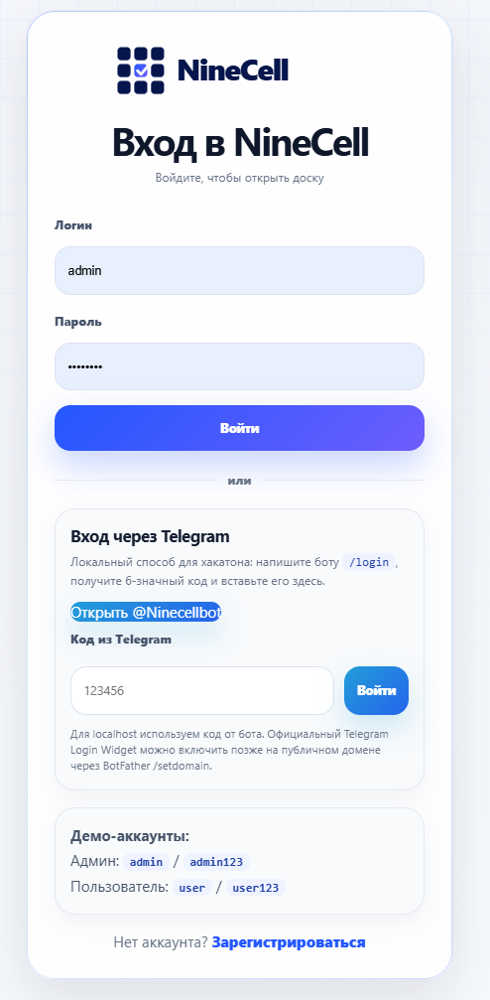
</p>

### Главная канбан-доска

<p align="center">
  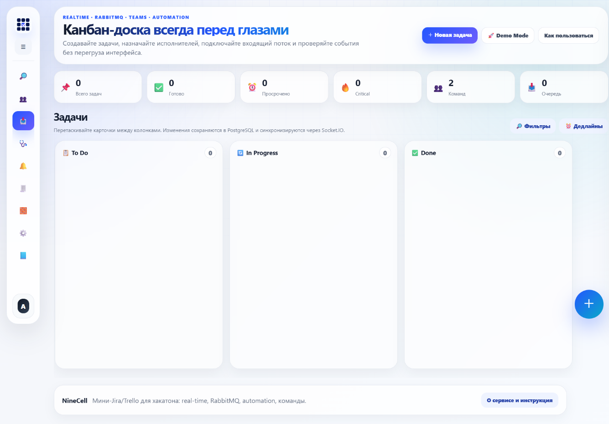
</p>

### Доска с задачами

<p align="center">
  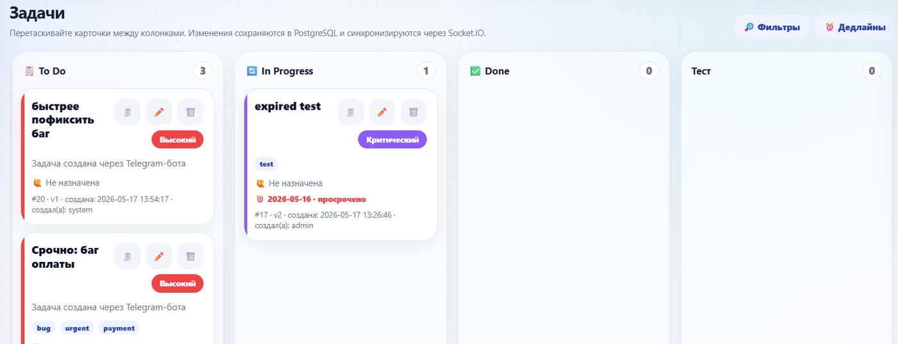
</p>

### Создание задачи

<p align="center">
  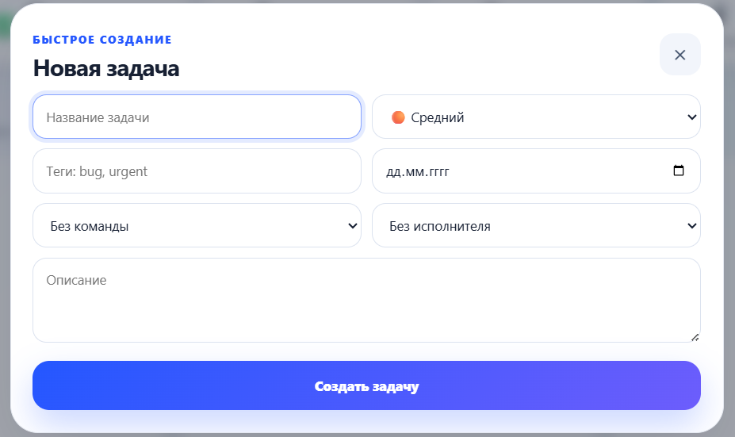
</p>

### Команды

<p align="center">
  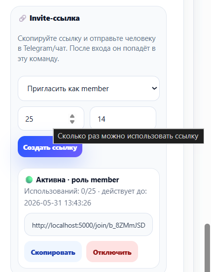
</p>

### Уведомления

<p align="center">
  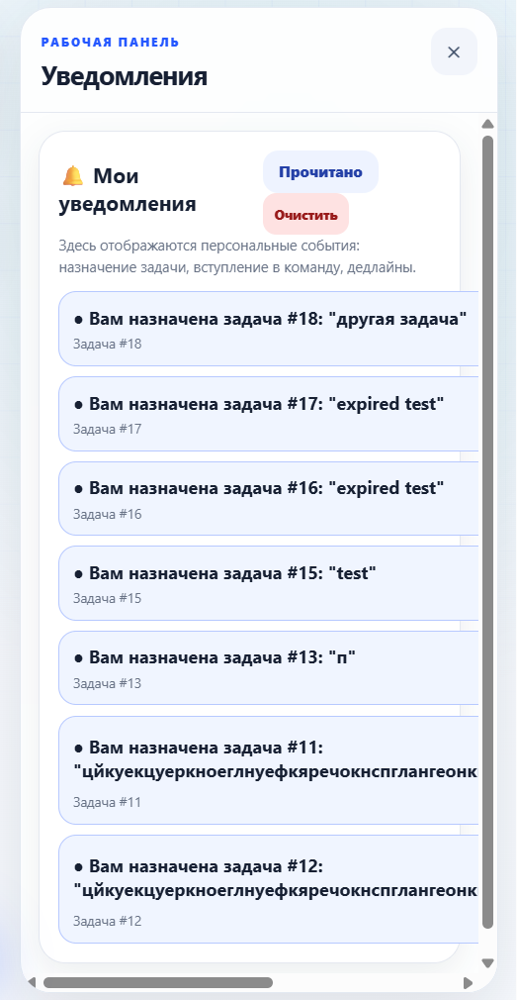
</p>

### Очередь входящих задач

<p align="center">
  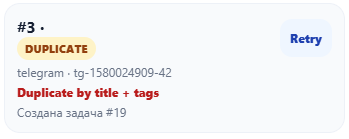
</p>

### Telegram-бот

<p align="center">
  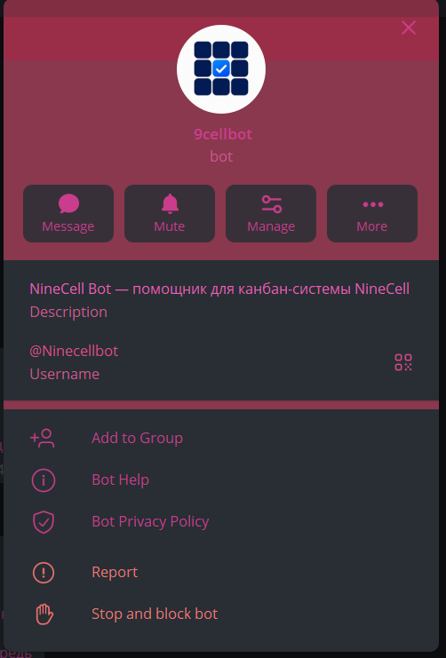
</p>

### Статус системы

<p align="center">
  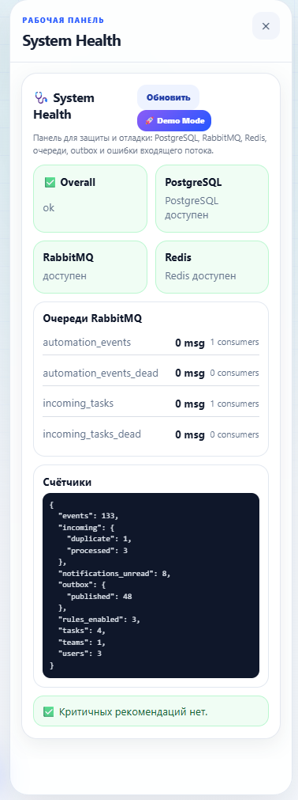
</p>

---

## Как пользоваться сервисом

### 1. Вход в аккаунт

Пользователь может войти:

- по логину и паролю;
- через Telegram-код.

Telegram-вход удобен тем, что после него аккаунт связывается с Telegram, и бот сможет отправлять уведомления.

---

### 2. Создание задачи

На доске нужно нажать кнопку **＋** или **Новая задача**.

В форме задачи можно указать:

- название;
- описание;
- приоритет;
- теги;
- дедлайн;
- команду;
- исполнителя.

После создания задача появляется на доске.

---

### 3. Редактирование задачи

В карточке задачи можно нажать кнопку редактирования.

Можно изменить:

- название;
- описание;
- приоритет;
- теги;
- дедлайн;
- колонку;
- команду;
- исполнителя.

---

### 4. Перемещение задачи

Задача перемещается между колонками канбан-доски.

Каждое перемещение сохраняется как событие и синхронизируется с другими пользователями.

---

### 5. Удаление задачи

При удалении появляется модальное окно подтверждения. Это защищает от случайного удаления.

После подтверждения задача удаляется, а событие фиксируется в истории.

---

### 6. Просмотр истории задачи

История показывает, что происходило с задачей:

- когда она была создана;
- кто её изменил;
- куда она перемещалась;
- какие правила могли сработать;
- какие события связаны с задачей.

Это помогает понять, почему задача находится в текущем состоянии.

---

## Роли и права доступа

В NineCell важно разделение прав.

### Глобальный администратор

Администратор может:

- видеть все команды;
- видеть больше задач;
- создавать и удалять команды;
- управлять участниками;
- создавать правила автоматизации;
- смотреть входящий поток задач;
- смотреть статус системы;
- работать с техническими разделами.

### Администратор команды

Администратор команды может:

- редактировать свою команду;
- добавлять участников;
- удалять участников;
- менять роли участников;
- создавать invite-ссылки;
- назначать задачи участникам команды.

### Обычный пользователь

Обычный пользователь может:

- видеть свои задачи;
- видеть задачи команд, где он состоит;
- видеть задачи, назначенные на него;
- получать уведомления;
- создавать доступные ему задачи;
- работать с задачами в рамках своих прав.

---

### Что обычный пользователь не видит

Обычный пользователь не видит то, что доступно администраторам:

- технический статус системы;
- все команды вне своего доступа;
- чужие личные задачи;
- глобальные административные настройки;
- часть правил автоматизации;
- полный контроль входящего потока;
- управление всеми пользователями.

Это сделано специально, чтобы данные разных команд не смешивались и пользователи не получали лишний доступ.

---

## Команды и приглашения

Команда - это группа пользователей, которые работают над общими задачами.

### Что есть у команды

- название;
- описание;
- список участников;
- роли участников;
- invite-ссылки;
- командные задачи.

### Как добавить участника

Есть два способа.

#### 1. Добавить зарегистрированного пользователя

Администратор команды выбирает пользователя из списка и добавляет его в команду.

#### 2. Отправить invite-ссылку

Администратор создаёт invite-ссылку и отправляет её человеку. После входа пользователь вступает в команду.

### Что происходит с задачами команды

Если задача создана в команде, её видят участники этой команды.

Если пользователь не состоит в команде, он не увидит задачи этой команды, если у него нет специальных прав.

---

## Задачи и канбан-доска

### Поля задачи

У задачи есть:

- ID;
- название;
- описание;
- колонка;
- приоритет;
- теги;
- дата создания;
- дедлайн;
- создатель;
- команда;
- исполнитель;
- версия.

### Приоритеты

Поддерживаются приоритеты:

- low;
- medium;
- high;
- critical.

Приоритет помогает понять, какие задачи требуют внимания в первую очередь.

### Дедлайны

Если дедлайн просрочен, задача визуально выделяется. Это помогает быстрее увидеть проблемные задачи.

### Теги

Теги помогают группировать задачи.

Примеры тегов:

- `bug`;
- `frontend`;
- `backend`;
- `urgent`;
- `payment`;
- `design`.

Теги также могут использоваться в правилах автоматизации.

---

## Фильтры и поиск

Фильтры помогают быстро найти нужные задачи.

Доступные сценарии:

- показать все задачи;
- показать только мои задачи;
- показать задачи без исполнителя;
- показать просроченные задачи;
- показать задачи с дедлайном сегодня;
- отфильтровать по приоритету;
- отфильтровать по команде;
- отфильтровать по исполнителю;
- найти задачу по тексту;
- найти задачу по тегу.

---

## Уведомления

NineCell поддерживает несколько видов уведомлений.

### Toast-уведомления

Это короткие всплывающие сообщения в интерфейсе.

Они появляются, когда:

- задача создана;
- задача удалена;
- задача перемещена;
- команда изменена;
- правило сработало;
- произошла ошибка.

### Личная лента уведомлений

Каждый пользователь имеет свой список уведомлений.

Примеры:

- задача назначена пользователю;
- задача изменилась;
- приближается дедлайн;
- пришло системное сообщение.

Пользователь может очистить свои уведомления. Очистка не влияет на уведомления других пользователей.

### Telegram-уведомления

Если пользователь вошёл через Telegram-код, его аккаунт связывается с Telegram ID.

После этого бот может отправить сообщение, когда пользователю назначают задачу.

---

## Telegram-бот

Telegram-бот делает работу быстрее.

### Что умеет бот

- выдаёт одноразовый код для входа;
- создаёт задачи из сообщений;
- понимает теги через `#`;
- отправляет задачу во входящий поток;
- отправляет уведомления назначенному исполнителю.

### Кнопки бота

После `/start` бот показывает:

- **🔐 Получить код**;
- **📝 Создать задачу**.

### Пример создания задачи

```text
Срочно: не работает оплата #bug #urgent #payment
```

Такая задача попадёт во входящий поток, пройдёт обработку и появится на доске.

---

## Входящий поток задач

Входящий поток - это способ принимать задачи извне.

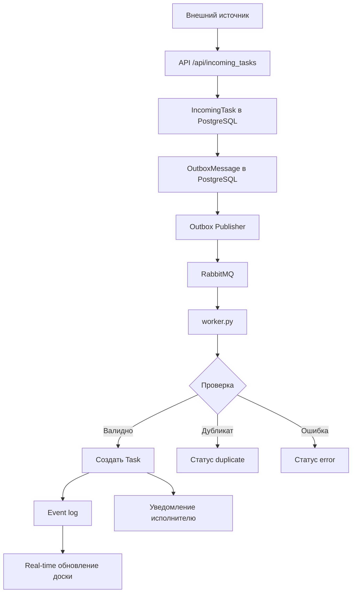

### Этапы обработки

1. Задача приходит через API или Telegram.
2. Система сохраняет входящее сообщение.
3. Сообщение попадает в outbox.
4. Outbox publisher отправляет сообщение в RabbitMQ.
5. Worker забирает сообщение.
6. Worker валидирует данные.
7. Worker проверяет дубликаты.
8. Worker обогащает задачу.
9. Worker создаёт карточку на доске.
10. Пользователи получают real-time обновление.

### Статусы входящей задачи

| Статус | Значение |
|---|---|
| `pending` | задача сохранена, но ещё не отправлена |
| `queued` | задача поставлена в очередь |
| `processed` | задача успешно обработана |
| `duplicate` | найден дубликат |
| `error` | произошла ошибка обработки |

### Retry

Если задача получила статус `error`, администратор может нажать **Retry**.

Система повторно отправит задачу в очередь и попробует обработать её снова.

---

## Правила автоматизации

Правила автоматизации - одна из самых важных частей NineCell.

Они помогают системе реагировать на события без ручной работы.

### Общий принцип

```text
Когда произошло событие,
если условие выполнено,
сделать действие.
```

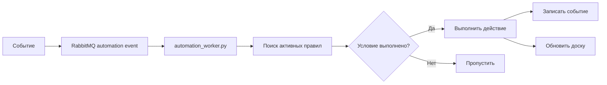

### События

Правило может запускаться при событиях:

- создание задачи;
- обновление задачи;
- перемещение задачи;
- удаление задачи;
- обработка входящей задачи.

### Условия

Условие может проверять:

- приоритет;
- колонку;
- теги;
- название;
- дедлайн;
- всегда выполняться.

### Операторы

Поддерживаются разные типы сравнения:

- равно;
- не равно;
- содержит.

### Действия

Правило может выполнить действие:

- переместить задачу в другую колонку;
- отправить уведомление;
- изменить приоритет;
- добавить тег.

### Примеры полезных правил

| Название правила | Событие | Условие | Действие |
|---|---|---|---|
| Critical сразу в работу | task_created | priority = critical | move_column → In Progress |
| Баги важнее | incoming_task | tags содержит bug | set_priority → high |
| Срочные задачи | task_created | title содержит срочно | add_tag → urgent |
| Уведомить о дедлайне | task_updated | deadline = today | send_notification |
| Оплата отдельно | incoming_task | title содержит payment | add_tag → payment |

### Почему это полезно

Правила уменьшают количество ручных действий.

Например, если в Telegram пришла задача:

```text
Срочно: ошибка оплаты #bug #urgent
```

NineCell может автоматически:

1. поставить высокий или критичный приоритет;
2. добавить тег `bug`;
3. переместить задачу в работу;
4. отправить уведомление исполнителю;
5. записать событие в историю.

---

## История событий

История показывает, что происходило в системе.

События помогают ответить на вопросы:

- кто создал задачу;
- кто её изменил;
- когда задача была перемещена;
- какое правило сработало;
- откуда пришла входящая задача;
- была ли ошибка обработки.

Для пользователя это удобно, потому что можно понять контекст задачи.  
Для программиста это полезно, потому что события помогают отлаживать систему.

---

## System Health Dashboard

System Health Dashboard - это техническая панель состояния проекта.

Она показывает:

- доступность PostgreSQL;
- доступность RabbitMQ;
- доступность Redis;
- состояние очередей;
- количество pending-сообщений;
- количество ошибок;
- количество задач;
- количество команд;
- количество пользователей;
- количество событий.

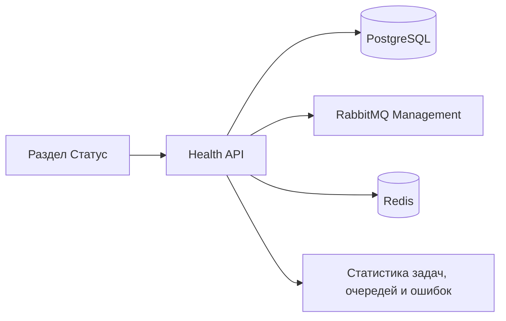

Панель помогает быстро понять, работает ли вся система, а не только веб-интерфейс.

---

## Архитектура для программистов

### Общая схема

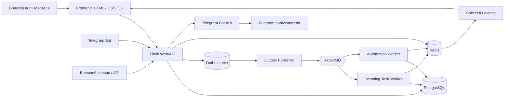

### Основные backend-компоненты

| Файл | Назначение |
|---|---|
| `app.py` | основное Flask-приложение, API, модели, страницы |
| `worker.py` | обработка входящих задач из RabbitMQ |
| `automation_worker.py` | выполнение правил автоматизации |
| `outbox_publisher.py` | отправка outbox-сообщений в RabbitMQ |
| `rabbitmq_client.py` | настройка RabbitMQ exchange и queue |
| `telegram_bot.py` | Telegram-бот |
| `docker-compose.yml` | запуск всех сервисов |

---

## Как работает сохранение и синхронизация

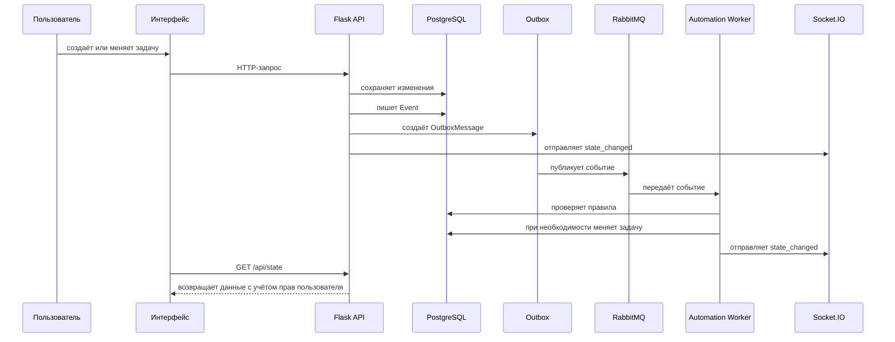

### Почему данные не теряются после перезагрузки

Все задачи, команды, пользователи, события и уведомления хранятся в PostgreSQL.

Браузер только отображает данные. Источник правды - база данных.

---

## Как работает очередь RabbitMQ

RabbitMQ нужен, чтобы обрабатывать входящие задачи и события не прямо в момент запроса, а через отдельные worker-процессы.

Это даёт преимущества:

- веб-интерфейс не зависает;
- задачи можно обрабатывать в фоне;
- можно повторять обработку после ошибки;
- можно масштабировать worker-процессы;
- можно подключать внешние источники.

---

## Как работает безопасность и приватность данных

NineCell разделяет данные по пользователям и командам.

### Пользователь видит

- свои личные задачи;
- задачи, где он исполнитель;
- задачи команд, где он участник;
- свои уведомления.

### Администратор команды видит

- задачи своей команды;
- участников своей команды;
- invite-ссылки своей команды;
- может назначать задачи участникам своей команды.

### Глобальный администратор видит

- все команды;
- расширенные настройки;
- входящий поток;
- правила автоматизации;
- статус системы;
- больше технических данных.

### Почему это важно

Если сервисом пользуются много людей, каждый должен видеть только те данные, которые относятся к нему или его команде. Это снижает риск ошибок, утечек и случайного изменения чужих задач.

---

## Запуск через Docker

Docker-вариант запускает все сервисы.

### 1. Установить Docker Desktop

Проверка:

```powershell
docker --version
docker compose version
docker info
```

### 2. Создать `.env`

```powershell
copy .env.example .env
```

Пример:

```env
SECRET_KEY=change-me-super-secret
INCOMING_API_KEY=dev-incoming-token

DEMO_ADMIN_PASSWORD=NineCellAdmin-2026
DEMO_USER_PASSWORD=NineCellUser-2026

RABBITMQ_USER=ninecell
RABBITMQ_PASSWORD=NCellRabbit-2026

TELEGRAM_BOT_TOKEN=
TELEGRAM_BOT_USERNAME=
TELEGRAM_LOGIN_TTL_SECONDS=600
PUBLIC_BASE_URL=http://localhost:5000
```

### 3. Запустить

```powershell
docker compose up --build
```

Сайт:

```text
http://localhost:5000
```

RabbitMQ Management:

```text
http://localhost:15672
```

---

## Запуск без Docker

Этот вариант подходит, если Docker не установлен или не запускается.

При обычном запуске используется SQLite. Базовая работа сайта доступна, но RabbitMQ, Redis и полноценная worker-архитектура требуют отдельных сервисов.

### 1. Создать виртуальное окружение

```powershell
python -m venv .venv
```

### 2. Активировать окружение

```powershell
.\.venv\Scripts\activate
```

### 3. Установить зависимости

```powershell
pip install -r requirements.txt
```

### 4. Создать `.env`

```powershell
copy .env.example .env
```

### 5. Запустить приложение

```powershell
python app.py
```

Сайт:

```text
http://localhost:5000
```

---

## Демо-аккаунты

| Роль | Логин | Пароль |
|---|---|---|
| Администратор | `admin` | `NineCellAdmin-2026` |
| Пользователь | `user` | `NineCellUser-2026` |

Пароли специально не используют простые `admin123` и `user123`, чтобы браузер не показывал предупреждения о скомпрометированных паролях.

---

## Работа с базой данных

### Зайти в PostgreSQL

```powershell
docker compose exec postgres psql -U kanban -d kanban
```

### Посмотреть таблицы

```sql
\dt
```

### Полезные запросы

```sql
SELECT id, username, role, telegram_id, telegram_username
FROM "user";

SELECT id, name, description
FROM team
ORDER BY id;

SELECT team_id, user_id, role
FROM team_member
ORDER BY team_id;

SELECT id, title, priority, tags, team_id, assignee_id, version
FROM task
ORDER BY id DESC;

SELECT id, user_id, task_id, message, type, is_read, created_at
FROM notification
ORDER BY id DESC;

SELECT id, source, external_id, status, task_id, error
FROM incoming_task
ORDER BY id DESC;

SELECT id, routing_key, status, attempts, error
FROM outbox_message
ORDER BY id DESC;

SELECT id, type, task_id, created_at
FROM event
ORDER BY id DESC
LIMIT 20;
```

### Выйти

```sql
\q
```

---

## Развёртывание на сервере

Минимальный запуск на VPS:

```bash
git clone https://github.com/your-user/your-repo.git
cd NineCell
cp .env.example .env
nano .env
docker compose up -d --build
```

После запуска:

```text
http://SERVER_IP:5000
```

Для публичного запуска рекомендуется:

- настроить домен;
- подключить nginx;
- включить HTTPS;
- использовать сложный `SECRET_KEY`;
- закрыть наружу порты PostgreSQL, RabbitMQ и Redis;
- настроить резервные копии PostgreSQL;
- указать корректный `PUBLIC_BASE_URL`;
- использовать отдельные production-пароли;
- настроить мониторинг и логи.

---

## Планы на будущее

NineCell уже имеет основу для развития в полноценный командный продукт. Возможные направления развития:

### 1. Workspace и несколько досок

Добавить уровень выше команд:

```text
Workspace → Team → Board → Column → Task
```

Это позволит одной организации иметь несколько проектов и досок.

### 2. Комментарии к задачам

Добавить обсуждение внутри карточки задачи:

- комментарии;
- упоминания пользователей;
- история обсуждения;
- уведомления при ответе.

### 3. Вложения

Добавить файлы к задачам:

- изображения;
- документы;
- скриншоты;
- технические файлы.

### 4. Подзадачи и чек-листы

Добавить внутри задачи:

- чек-листы;
- подзадачи;
- прогресс выполнения;
- блокирующие задачи.

### 5. Расширенная автоматизация

Улучшить правила:

- несколько условий в одном правиле;
- несколько действий;
- расписание;
- SLA-правила;
- эскалации;
- шаблоны правил.

### 6. Rule Execution Log

Добавить отдельный журнал срабатывания правил:

- какое правило сработало;
- для какой задачи;
- когда;
- какое действие выполнилось;
- была ли ошибка.

### 7. GitHub / Google / CRM интеграции

Добавить интеграции:

- GitHub Issues;
- Google Forms;
- Google Calendar;
- Slack;
- CRM;
- email-to-task.

### 8. Настройки уведомлений

Дать пользователю возможность выбрать:

- получать ли Telegram-уведомления;
- получать ли уведомления о дедлайнах;
- получать ли уведомления только по своим задачам;
- отключать некоторые типы уведомлений.

### 9. Улучшенная аналитика

Добавить отчёты:

- сколько задач создано;
- сколько закрыто;
- среднее время выполнения;
- количество просрочек;
- загрузка участников;
- задачи по приоритетам.

### 10. Production-улучшения

Для промышленного запуска можно добавить:

- Alembic-миграции;
- автоматические тесты;
- CI/CD;
- nginx;
- HTTPS;
- backup PostgreSQL;
- structured logging;
- отдельную систему мониторинга.

---

## Частые проблемы

### Docker не запускается

Откройте Docker Desktop и дождитесь запуска Engine.

Если появляется ошибка WSL:

```powershell
wsl --update
wsl --shutdown
```

### RabbitMQ не принимает новый пароль

RabbitMQ может помнить старого пользователя из Docker volume.

Варианты:

1. временно использовать старые данные;
2. удалить RabbitMQ volume;
3. выполнить `docker compose down -v`, если тестовые данные можно удалить.

### Telegram-уведомления не приходят

Проверьте:

- `TELEGRAM_BOT_TOKEN` указан в `.env`;
- пользователь входил через Telegram-код;
- у пользователя есть `telegram_id`;
- контейнеры перезапущены после изменения `.env`;
- пользователь не заблокировал бота.

### Скриншоты не отображаются в README

Проверьте, что файлы лежат в проекте:

```text
static/docs/screenshot-login.png
static/docs/screenshot-board.png
static/docs/screenshot-board-tasks.png
static/docs/screenshot-create-task.png
static/docs/screenshot-teams.png
static/docs/screenshot-notifications.png
static/docs/screenshot-queue.png
static/docs/screenshot-telegram-bot.png
static/docs/screenshot-health.png
```

---

## Структура проекта

```text
NineCell/
├── app.py                    # основной Flask backend
├── worker.py                 # обработка входящих задач из RabbitMQ
├── automation_worker.py      # автоматизация правил через RabbitMQ
├── outbox_publisher.py       # отправка outbox-сообщений в RabbitMQ
├── rabbitmq_client.py        # настройка RabbitMQ exchange и queue
├── telegram_bot.py           # Telegram-бот
├── docker-compose.yml        # запуск web, PostgreSQL, RabbitMQ, Redis и worker-ов
├── dockerfile                # Docker-образ Python-приложения
├── requirements.txt          # Python-зависимости
├── README.md
├── TESTING.md
├── static/
│   ├── css/
│   ├── img/
│   └── docs/
└── templates/
```

---

## Лицензия

Учебный open-source проект для командной работы, автоматизации задач и демонстрации event-driven подхода.
